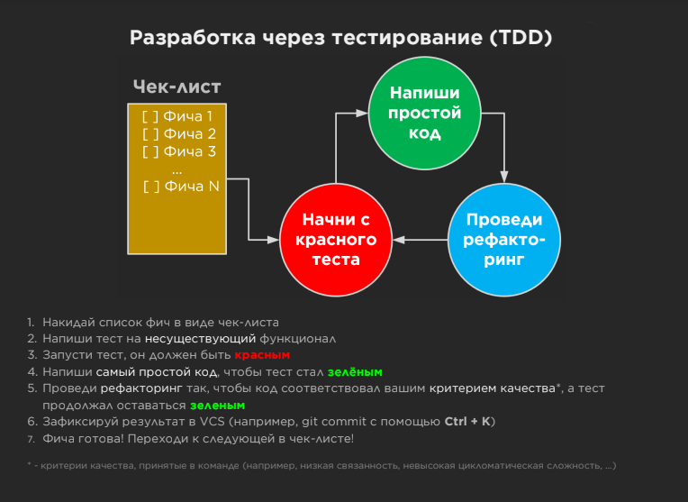

# Mars Rover Kata for TDD
Mars Rover Kata for TDD

### Setup
```sh
git clone https://github.com/timmson/mars-rover.git
cd mars-rover
npm i
```

### TDD Exercise

#### Requirements
- [Mars Rover Kata at kata-log.rocks](https://kata-log.rocks/mars-rover-kata)

#### TDD Cycle



#### Description

To start exercise at first checkout ```master``` branch: ```git checkout master```.

Your goal is to create ```RoverReducer``` in ```src/rover-reducer``` like that:
````js
/**
 * 
 * @param oldState like {
 *   x: 0,
 *   y: 0,
 *   direction: EAST // direcion is any of [EAST, NORTH, SOUTH, WEST]
 * }
 * @param action is any of [FORWARD, BACKWARD, TURN_RIGHT, TURN_LEFT]
 * @returns newState with the same structure as oldState
 * @constructor
 */
export default function RoverReducer(state: State, action: string) {
     //...
     return newState
}
````

You should start to write your tests in ```test/test-rover-reducer``` with TDD:

1. When action is TURN_RIGHT then rover should change direction clockwise
2. When action is TURN_LEFT then rover should change direction counterclockwise
3. Think about refactoring ;)
4. When action is FORWARD then rover should move to current direction with SPEED
5. When action is BACKWARD then rover should move back from current direction with SPEED
6. Think about refactoring;)

To test your application in browser, use your real RoverReducer in ```src/app.js:6``` and run ```npm start```.

At the end you could write like this [..::Live demo::..](https://timmson.github.io/mars-rover/).

Our solution is placed in [solution branch](../solution).
